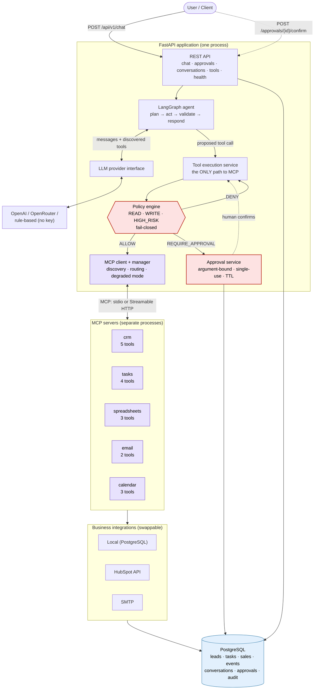
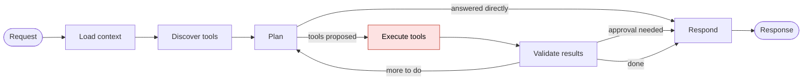
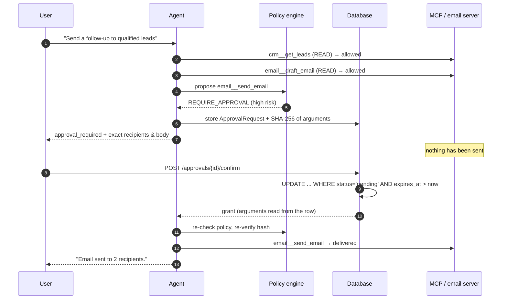

# MCP Business Assistant

An AI agent that performs real business work — managing CRM leads, follow-up tasks,
sales reporting, calendars and customer email — by calling tools exposed over the
**Model Context Protocol (MCP)**.

The agent contains **no hard-coded list of tools**. It discovers what it can do at
runtime from five connected MCP servers and plans against whatever it finds. And it
cannot send an email, or take any other irreversible action, without a human
approving that exact action first — a guarantee enforced in backend code that no
prompt can talk its way around.

```bash
git clone https://github.com/rishab-sharma/mcp-business-assistant.git
cd mcp-business-assistant
docker compose up --build          # no API key required
```

Then open <http://localhost:8000> for the web console, or
<http://localhost:8000/docs> for the API reference.

[](https://www.python.org/)
[](https://modelcontextprotocol.io/)
[](https://fastapi.tiangolo.com/)
[](https://langchain-ai.github.io/langgraph/)
[](#testing)
[](#testing)
[](LICENSE)

---

## Table of contents

- [What it does](#what-it-does)
- [Key features](#key-features)
- [Why MCP](#why-mcp)
- [Architecture](#architecture)
- [The agent workflow](#the-agent-workflow)
- [Dynamic tool discovery](#dynamic-tool-discovery)
- [Security and the approval workflow](#security-and-the-approval-workflow)
- [Technology stack](#technology-stack)
- [Project structure](#project-structure)
- [Installation](#installation)
- [Configuration](#configuration)
- [Docker](#docker)
- [Web console](#web-console)
- [API reference](#api-reference)
- [Worked example](#worked-example)
- [Testing](#testing)
- [Design decisions worth defending](#design-decisions-worth-defending)
- [Future improvements](#future-improvements)

---

## What it does

Ask in plain language; the agent decides which tools to call and in what order.

| You ask | What happens |
|---|---|
| "Show me today's meetings." | `calendar__get_todays_meetings` |
| "Find the latest leads in the CRM." | `crm__get_leads` |
| "Add Ada Lovelace as a lead." | `crm__create_lead` |
| "Create a follow-up task for Ada." | `crm__search_leads` → `tasks__create_task` |
| "Summarise this week's sales." | `spreadsheets__get_sales_summary` |
| "Generate the weekly report." | `spreadsheets__generate_weekly_report` |
| "Show me overdue tasks." | `tasks__get_overdue_tasks` |
| "Send a follow-up email to qualified leads." | `crm__get_leads` → `email__draft_email` → **approval required** → `email__send_email` |

That last row is the interesting one. Three tools chain together, recipients come
from the CRM rather than from the prompt, and the run **stops** before sending. The
API returns the exact message and recipient list awaiting a decision; nothing is
sent until a human confirms.

## Key features

- **17 tools across 5 independent MCP servers** (CRM, tasks, spreadsheets, email,
  calendar), built on the official MCP Python SDK — no hand-rolled protocol.
- **Runtime tool discovery.** Add a tool to a server, restart, and the agent can use
  it. No agent code, dispatch table or prompt changes.
- **Deterministic permission engine.** Every tool is READ, WRITE or HIGH_RISK, and
  unregistered tools fail closed to HIGH_RISK.
- **Human-in-the-loop approvals**, cryptographically bound to the exact arguments a
  human was shown, single-use, and TTL-bound.
- **Pluggable LLM providers** — OpenAI, OpenRouter, any OpenAI-compatible endpoint,
  plus a deterministic rule-based provider so the whole system runs with no API key.
- **Swappable business integrations** behind interfaces: local PostgreSQL by
  default, with a working HubSpot CRM integration and a real SMTP email provider.
- **Full audit trail** of every decision, tool call, result and approval event, with
  credentials redacted before they can be written.
- **A web console at `/`** that makes the approval workflow visible — approve or
  reject a pending action from the browser.
- **258 tests, 84% coverage**, no API key and no network required.

## Why MCP

Most "AI agent" projects hard-code their tools: a Python function per capability,
a dispatch dictionary, and a prompt listing what exists. That works until the tools
belong to somebody else.

MCP makes tools a **protocol boundary** rather than a code dependency. Concretely,
in this project:

- **Tool servers are separately deployable.** Each of the five servers runs as its
  own process, and `MCP_TRANSPORT=http` runs them as independent HTTP services
  instead of subprocesses — with no change to the agent.
- **Capability is discovered, not declared.** The agent asks each server what it
  offers and receives names, descriptions and JSON Schemas. Adding
  `crm__merge_duplicates` makes it immediately available.
- **Teams can own their own tools.** A CRM team ships a CRM server; the agent team
  never edits it.
- **Third-party servers work the same way.** Anything speaking MCP plugs in — which
  is also why this project refuses to trust a server's self-declared safety hints
  (see [Security](#security-and-the-approval-workflow)).

The trade-off is real: a process boundary costs latency and adds failure modes that
an in-process function call does not have. That is why the manager supports degraded
operation and why the tool layer treats failure as data rather than an exception.

## Architecture



**Layer boundaries, and what each one is not allowed to do:**

| Layer | Responsibility | Forbidden |
|---|---|---|
| API | HTTP, auth, serialisation | Business logic, SQL |
| Agent | Planning, orchestration | Deciding permissions, provider-specific code |
| Tool execution | **Authorisation**, dispatch, audit | Bypassing the policy engine |
| MCP client | Transport, discovery, routing | Any permission check |
| MCP servers | Exposing capabilities as tools | Authorisation decisions |
| Integrations | Talking to business systems | Leaking provider types upward |
| Repositories | **All** SQL | Being called from tools directly |

## The agent workflow



Each node is a plain async function over a typed `AgentState`; LangGraph supplies
the state machine, the conditional routing and the bounded loop. Notably, LangGraph
does **not** talk to the model — nodes call the project's own `LLMProvider`
interface, which is what keeps provider code isolated and the agent testable with a
scripted fake.

`AgentState` carries `conversation_id`, `user_id`, `current_request`,
`conversation_history`, `available_tools`, `selected_tools`, `tool_calls`,
`tool_results`, `final_response`, `pending_approval`, `errors`, `status` and the
iteration counter that bounds the loop.

The **Execute tools** node is the security gate: every proposed call goes through
the tool execution service, which is the only component permitted to reach the MCP
manager.

## Dynamic tool discovery

At startup the manager connects to each server and asks what it offers:

```text
mcp.tools_discovered  tool_count=17  servers=[calendar, crm, email, spreadsheets, tasks]
                      read=10  write=5  high_risk=2
```

Each discovered tool becomes a `ToolSpec` — qualified name, description, JSON Schema
— and is handed to the model through the provider's native tool-calling interface.
Tool names are namespaced `server__tool` (double underscore, because OpenAI-style
function names must match `^[a-zA-Z0-9_-]+$` and tool names already contain single
underscores).

Inspect the live catalog:

```bash
curl localhost:8000/api/v1/tools | jq '.tools[] | {name, permission, requires_approval}'
```

**To add a tool**, add a function to an MCP server and classify it in
`app/security/permissions.py`. That is the entire change — and forgetting the
classification is safe, because unregistered tools default to HIGH_RISK.

## Security and the approval workflow

> An AI agent is an untrusted component that produces *proposals*. Everything that
> turns a proposal into an action must be decided by code the model cannot reach.

**Permission levels** — assigned by this application, in `app/security/permissions.py`:

| Level | Behaviour | Tools |
|---|---|---|
| `READ` | Runs automatically | `get_leads`, `get_lead`, `search_leads`, `get_tasks`, `get_overdue_tasks`, `get_sales_summary`, `generate_weekly_report`, `get_events`, `get_todays_meetings`, `draft_email` |
| `WRITE` | Runs automatically (configurable) | `create_lead`, `update_lead_status`, `create_task`, `complete_task`, `add_sales_record` |
| `HIGH_RISK` | **Always** needs human approval | `send_email`, `create_event` |
| *unregistered* | Treated as HIGH_RISK | anything else |

Four properties make this hold up:

1. **The registry lives in the API process, not in the MCP servers.** A server can
   advertise `read_only_hint: true` for a tool that deletes your database. Those
   annotations arrive over the wire from whoever runs the server, so treating them
   as authorisation would delegate authorisation to the thing being authorised. They
   are displayed and cross-checked; the local classification always wins.
2. **It fails closed.** Connect an unknown server and its tools are usable but gated.
3. **The model has no influence.** Classification is a dictionary lookup on a tool
   name. No prompt, tool output or conversation history can change the result — which
   is what makes the guarantee survive prompt injection.
4. **There is exactly one path to MCP.** `MCPManager.call_tool` performs no checks by
   design; only `ToolExecutionService` calls it. One place to audit.

### The approval flow



What each guard is actually for:

| Guard | Attack it stops |
|---|---|
| SHA-256 over canonical arguments | Approve a benign draft, then swap the recipients before sending |
| Conditional `UPDATE` on the status transition | Two concurrent confirmations sending the same email twice |
| Arguments read from the stored row, never the request | The confirming call altering what runs |
| TTL expiry, evaluated by the database | An approval sitting for a week and firing into a changed world |
| Policy re-checked *with* the grant | A valid approval outliving the caller's permission to use it |
| Ownership check on decisions | One user approving another user's pending email |
| Hard recipient ceiling → `DENY` | A runaway loop turning one approval into a mass mailing |

Full reasoning: **[docs/security.md](docs/security.md)**.

## Technology stack

| Concern | Choice | Why |
|---|---|---|
| Tool protocol | **MCP 2.2** (official Python SDK) | Tools as a protocol boundary, not a code dependency |
| Agent orchestration | **LangGraph 1.2** | Explicit state machine, conditional routing, bounded loops |
| API | **FastAPI 0.141** | Async, typed, OpenAPI for free |
| Validation | **Pydantic 2.13** | One model serves tool schema, API contract and validation |
| Persistence | **SQLAlchemy 2.0** (async) + **PostgreSQL 16** | Typed ORM; portable types let tests run on SQLite |
| LLM | **OpenAI SDK 3.8** behind an interface | Swappable providers; no SDK leaks past the boundary |
| Tests | **pytest 9** + pytest-asyncio | 258 deterministic tests, no credentials |
| Packaging | **Docker** multi-stage, non-root | Small runtime image, unprivileged agent process |

## Project structure

```text
mcp-business-assistant/
├── app/
│   ├── api/
│   │   ├── routes/            # chat, approvals, conversations, tools, health
│   │   ├── dependencies.py    # DI wiring — the seam tests override
│   │   └── errors.py          # error contract; nothing internal escapes
│   ├── agents/
│   │   ├── graph.py           # LangGraph workflow
│   │   ├── nodes.py           # framework-free node functions
│   │   ├── state.py           # typed AgentState
│   │   ├── prompts.py         # behaviour only — never permissions
│   │   └── runner.py          # entry point + resume-after-approval
│   ├── mcp/
│   │   ├── client.py          # long-lived connection (supervisor-task pattern)
│   │   ├── manager.py         # lifecycle, routing, degraded mode
│   │   ├── discovery.py       # catalog + local classification
│   │   ├── validation.py      # pre-flight argument checks
│   │   └── config.py          # server registry + per-server child env
│   ├── security/
│   │   ├── permissions.py     # THE registry (fail-closed)
│   │   └── policy.py          # THE decision (deterministic)
│   ├── services/
│   │   ├── tool_execution_service.py   # the only path to MCP
│   │   ├── approval_service.py         # human-in-the-loop gate
│   │   ├── conversation_service.py
│   │   └── audit_service.py
│   ├── providers/llm/         # base, openai, fake, heuristic, factory
│   ├── integrations/          # crm, email, tasks, spreadsheets, calendar
│   ├── models/                # database/ (ORM) + schemas/ (DTOs, API)
│   ├── repositories/          # all SQL lives here
│   ├── core/                  # config, logging, security, exceptions
│   ├── static/                # single-page web console (no build step)
│   ├── db/                    # engine, session, types, seed
│   └── main.py                # app factory + lifespan
├── mcp_servers/               # 5 independently runnable MCP servers
├── tests/                     # unit/ · integration/ · fixtures/
├── docs/                      # architecture.md · security.md
├── alembic/                   # migration scaffolding
├── Dockerfile · docker-compose.yml · .env.example · pyproject.toml
```

## Installation

### Requirements

- Python 3.12+
- Docker and Docker Compose (recommended), or PostgreSQL 16 for a local run

### Local development

```bash
git clone https://github.com/rishab-sharma/mcp-business-assistant.git
cd mcp-business-assistant

python -m venv .venv
source .venv/bin/activate          # Windows: .venv\Scripts\activate
pip install -e ".[dev]"

cp .env.example .env               # defaults work as-is
uvicorn app.main:app --reload
```

The application creates its schema on startup and launches the five MCP servers as
subprocesses. Watch for:

```text
{"event": "mcp.tools_discovered", "tool_count": 17, "servers": [...]}
{"event": "app.ready", "tool_count": 17, "degraded": false}
```

To run without PostgreSQL, point at SQLite:

```bash
DATABASE_URL="sqlite+aiosqlite:///./local.db" SEED_DEMO_DATA=true uvicorn app.main:app
```

## Configuration

Everything is environment-driven; see [.env.example](.env.example) for the annotated
list. The settings that matter most:

| Variable | Default | Notes |
|---|---|---|
| `LLM_PROVIDER` | `heuristic` | `heuristic` needs no key; `openai`, `openrouter`, `openai_compatible` do |
| `LLM_API_KEY` | — | Required for the real providers; startup fails clearly without it |
| `LLM_MODEL` | `gpt-4o-mini` | Any tool-calling model |
| `DATABASE_URL` | PostgreSQL | `sqlite+aiosqlite:///./local.db` also works |
| `MCP_TRANSPORT` | `stdio` | `http` connects to independently deployed servers |
| `MCP_FAIL_FAST` | `false` | `true` refuses to start if any server is unreachable |
| `REQUIRE_APPROVAL_FOR_WRITES` | `false` | Holds WRITE tools to the HIGH_RISK bar |
| `APPROVAL_TTL_MINUTES` | `30` | How long a pending action stays confirmable |
| `AUTH_ENABLED` | `false` | `true` requires `X-API-Key`; a warning is logged if left off outside local |
| `CRM_PROVIDER` | `local` | `hubspot` swaps in the real API |
| `EMAIL_PROVIDER` | `mock` | `mock` writes to `data/outbox/outbox.jsonl`; `smtp` really sends |
| `SEED_DEMO_DATA` | `false` | Inserts demo leads/tasks/sales when tables are empty |

Secrets are held as `SecretStr` and redacted from every log line and audit row.
`.env` is gitignored; only `.env.example` is committed.

## Docker

```bash
docker compose up --build
```

Starts PostgreSQL 16 and the API (which launches the MCP servers as subprocesses),
seeds demo data, and serves on <http://localhost:8000>. No credentials needed —
the rule-based provider drives the agent.

To use a real model, put this in `.env`:

```env
LLM_PROVIDER=openai
LLM_API_KEY=sk-...
LLM_MODEL=gpt-4o-mini
```

To run the MCP servers as **independent HTTP services** instead of subprocesses —
which is what a multi-team deployment looks like:

```bash
docker compose --profile http up --build
```

The image is multi-stage, runs as a non-root user, and has a healthcheck against
`/health`.

## Web console

A single-page operator console is served at **`/`**. No build step and no
dependencies -- one file (`app/static/index.html`) talking to the same public API
documented at `/docs`, so it cannot drift from the backend.

```text
┌─────────────────────────────────────────────┬──────────────────────┐
│  17 tools · 5 servers   heuristic (dev mock)│  DISCOVERED TOOLS    │
├─────────────────────────────────────────────┤  crm                 │
│  YOU                                        │   ● get_leads        │
│  Send a follow-up email to qualified leads  │   ● create_lead      │
│                                             │  email               │
│  ASSISTANT                                  │   ● draft_email      │
│  I have prepared this action…               │   ● send_email    🔒 │
│  [crm__get_leads] [email__draft_email]      │                      │
│  [email__send_email]      3 steps · 570 ms  │  ● read              │
│  ┌───────────────────────────────────────┐  │  ● write             │
│  │ 🔒 Approval required — nothing sent   │  │  ● high risk  🔒     │
│  │ To: grace@navsys.mil, ada@analytical… │  │                      │
│  │ Subject: Following up on your interest│  │                      │
│  │ [ Approve and send ]   [ Reject ]     │  │                      │
│  └───────────────────────────────────────┘  │                      │
└─────────────────────────────────────────────┴──────────────────────┘
```

It exists to make the security model visible rather than described: the assistant
stops, shows the **exact** recipients and body awaiting a decision, and the message
is sent only when you click. Tools used in the last turn light up in the sidebar,
colour-coded by the permission level the backend assigned them.

Every value that originates from the model, a tool result or the database is inserted
with `textContent`, never `innerHTML` — tool output is untrusted input, and the same
reasoning that keeps the permission engine out of the prompt applies to the DOM.

## API reference

Interactive docs at `/docs`; OpenAPI JSON at `/openapi.json`.

| Method | Path | Purpose |
|---|---|---|
| `POST` | `/api/v1/chat` | Send a request to the assistant |
| `GET` | `/api/v1/approvals` | List actions awaiting a decision |
| `GET` | `/api/v1/approvals/{id}` | Inspect a pending action's exact arguments |
| `POST` | `/api/v1/approvals/{id}/confirm` | Approve and execute |
| `POST` | `/api/v1/approvals/{id}/reject` | Reject; never executed |
| `GET` | `/api/v1/conversations` | List your conversations |
| `GET` | `/api/v1/conversations/{id}` | Full transcript incl. tool calls and results |
| `GET` | `/api/v1/tools` | The live discovered catalog |
| `GET` | `/api/v1/tools/permissions` | The permission model as configured |
| `GET` | `/health` | Database + per-server MCP health |
| `GET` | `/` | Web console (single page) |

Every response carries `X-Request-ID`; errors use one shape:

```json
{
  "error": {
    "code": "approval_invalid_state",
    "message": "This approval request is already executed and cannot be confirmed.",
    "details": {}
  },
  "request_id": "6f1c2a8e9b3d4f5a"
}
```

Internal failures never leak a traceback, SQL fragment or connection string — only a
generic message and the request id, which ties the response to the logs and audit
rows for that request.

## Worked example

The scenario worth seeing, start to finish. Run it against the demo stack:

**1. Ask for something irreversible**

```bash
curl -s -X POST localhost:8000/api/v1/chat \
  -H 'Content-Type: application/json' \
  -d '{"message": "Send a follow-up email to our qualified leads"}' | jq
```

```jsonc
{
  "conversation_id": "7c9e6679-7425-40de-944b-e07fc1f90ae7",
  "status": "awaiting_approval",
  "approval_required": true,
  "approval": {
    "approval_id": "1b9d6bcd-bbfd-4b2d-9b5d-ab8dfbbd4bed",
    "tool_name": "email__send_email",
    "summary": "Send an email with the subject 'Following up on your interest' to 2 recipient(s): grace@navsys.mil, ada@analytical.io.",
    "risk_reason": "Sending an email is irreversible and visible to people outside the company.",
    "expires_at": "2026-09-08T14:30:00Z",
    "arguments": { "to": ["grace@navsys.mil", "ada@analytical.io"], "subject": "...", "body": "..." }
  },
  "tools_called": ["crm__get_leads", "email__draft_email", "email__send_email"],
  "iterations": 3
}
```

Three tools ran; the third **did not**. The recipients came from the CRM lookup, not
from the request text. Nothing has been sent.

**2. Confirm it**

```bash
curl -s -X POST localhost:8000/api/v1/approvals/1b9d6bcd-.../confirm \
  -H 'Content-Type: application/json' -d '{"note": "checked the recipient list"}' | jq
```

```jsonc
{
  "executed": true,
  "approval": { "status": "executed", "executed_at": "2026-09-08T14:05:12Z" },
  "response": "Email sent to 2 recipient(s) via the mock provider."
}
```

**3. Confirm again** — replay is refused:

```jsonc
{ "error": { "code": "approval_invalid_state", "message": "This approval request is already executed and cannot be confirmed." } }
```

**4. Inspect what happened.** `GET /api/v1/conversations/{id}` returns the full
transcript including every tool call and result, and the `audit_logs` table holds the
agent's decisions, the policy verdicts, the approval events and timings for the whole
request.

Read-only requests need no ceremony:

```bash
curl -s -X POST localhost:8000/api/v1/chat -H 'Content-Type: application/json' \
  -d '{"message": "what tasks are overdue?"}' | jq -r .response
# Found 2 task(s), 2 overdue: Send pricing to Ada Lovelace (due 2026-09-05T…);
# Follow up with Alan Turing (due 2026-09-07T…).
```

## Testing

```bash
pytest                      # 250 tests, ~30s, no credentials, no network
                            # (the 8 subprocess tests are opt-in; see -m slow)
pytest -m unit              # fast units only
pytest -m slow              # + MCP servers as real subprocesses
pytest --cov=app --cov=mcp_servers
```

| Suite | Count | What it covers |
|---|---|---|
| `unit` | 176 | Permissions, policy, approvals, redaction, hashing, repositories, providers, schema validation |
| `integration` | 74 | Real MCP servers, the agent loop, the ASGI app, the approval workflow |
| `slow` | 8 | Real subprocess transport + per-server credential isolation |
| `live` | opt-in | HubSpot / SMTP against real credentials (deselected by default) |

Three things make the suite trustworthy:

- **Real MCP, not a mock of it.** Integration tests connect to the actual server
  objects over the SDK's in-memory transport, so request serialisation, server-side
  schema validation and result mapping are all genuinely exercised.
- **A scripted LLM.** `FakeLLMProvider` replays a fixed sequence, which is what makes
  multi-step tool chains, approval pauses and error recovery assertable at all.
- **SQLite made to behave like PostgreSQL** — foreign keys enforced, timestamps
  timezone-aware — so the tests are not passing on semantics production does not have.

The security-critical modules carry the highest coverage: policy engine 94%,
tool execution 90%, approval service 88%.

## Design decisions worth defending

**Permissions live in the API process, not the MCP servers.** Server-declared
annotations are input, not authority. The catalog records a server's `read_only_hint`
and flags it when it disagrees with local policy — visible on `/tools` and in the
logs, never obeyed.

**A grant is a claim, not proof.** `ApprovalGrant` is an ordinary object anyone could
construct, so it carries no authority. Execution re-reads the row and re-verifies
status, expiry, tool identity and argument hash. Authority lives in persisted state.

**Audit rows commit immediately, outside the caller's transaction.** If a request
later fails and rolls back, the record of what was attempted must survive — an audit
trail that vanishes with the incident it documents is not an audit trail. It also
avoids holding a write transaction open across subprocess and network I/O.

**The agent never holds a long transaction across tool execution.** Side effects like
a sent email cannot be rolled back, so pretending the run is atomic would be a
fiction; each turn is committed as it happens.

**MCP connections use a supervisor task.** The SDK opens an `anyio` task group per
connection, and a task group must be exited by the task that entered it. A connection
that must outlive a request therefore cannot simply be stored and closed later — so
each connection owns a task that enters the context, publishes the client and parks
until shutdown.

**Money is `Decimal`, serialised as a fixed-precision string.** A float would
reintroduce the rounding error the `Numeric` column exists to prevent, and let a model
read back `249.99999999`.

**Two dev mocks, both labelled.** The heuristic provider exists so this project can be
evaluated in one command; `is_mock` is surfaced on `/health` and every mocked send is
logged as a mock, so it can never be mistaken for the real thing.

## Future improvements

Honest about what is not here:

- **Committed Alembic migration.** The scaffold is wired for `--autogenerate`; no
  revision is committed because one that has never run against a real PostgreSQL
  instance is a liability, not an asset.
- **Real authentication.** API-key auth exists and is off by default for the demo. A
  production deployment wants OAuth2/OIDC — the `get_current_user` dependency is the
  seam, and nothing else changes.
- **Streaming responses.** `POST /chat` is request/response. SSE token streaming with
  interleaved approval prompts is the natural next step.
- **Google Sheets and Google Calendar providers.** `GoogleSheetsIntegration` is a
  documented stub that raises a clear error rather than pretending to work; there is
  no Google Calendar provider yet, only the `CalendarInterface` seam it would slot
  into. By contrast the HubSpot CRM and SMTP email integrations are fully written —
  though covered only by the opt-in `live` suite, since testing them needs real
  credentials.
- **Per-user rate limiting and cost budgets.** The iteration ceiling bounds a single
  request; it does not bound spend across many.
- **Approval notifications.** Pending actions are polled through the API rather than
  pushed to Slack or email.
- **Distributed tracing.** Structured logs carry a request id end to end; OpenTelemetry
  spans would make cross-service latency visible once tool servers are deployed apart.

---

## Documentation

- **[docs/architecture.md](docs/architecture.md)** — layers, MCP client/server design,
  discovery, the LangGraph workflow, provider abstraction, database design, testing
  strategy and trade-offs.
- **[docs/security.md](docs/security.md)** — the threat model, why agents cannot hold
  unrestricted permissions, permission levels, the approval guarantees, audit logging
  and credential management.

## License

MIT — see [LICENSE](LICENSE).
