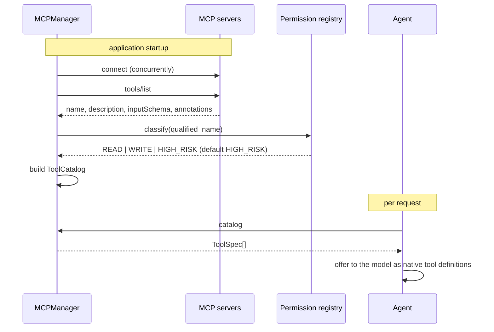
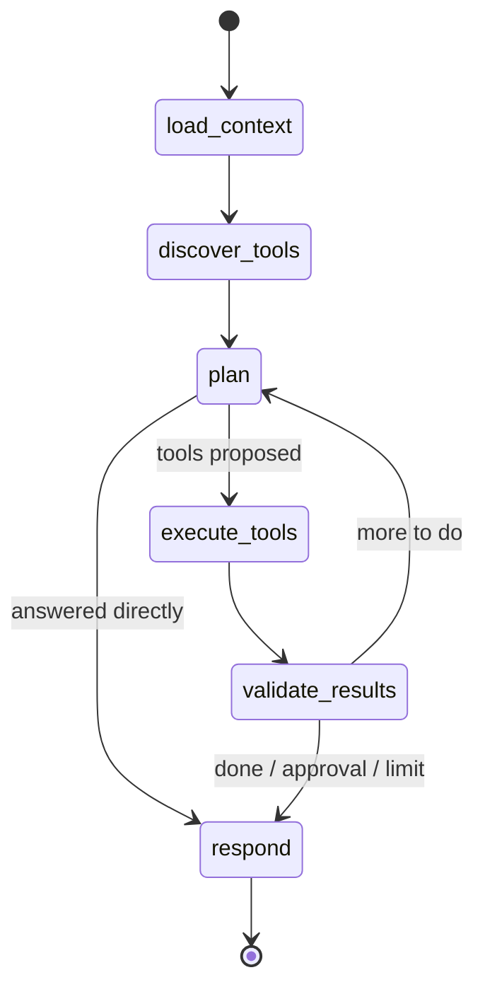
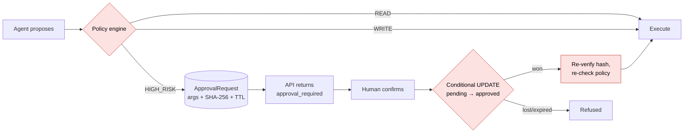
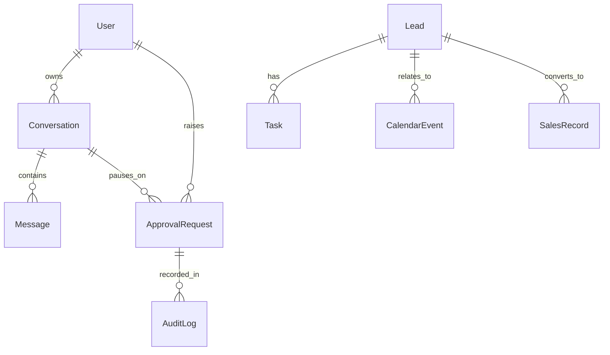

# Architecture

How this system is put together, and why. Where a decision has a real cost, that cost
is stated rather than glossed over.

- [The shape of the problem](#the-shape-of-the-problem)
- [Layers](#layers)
- [Why MCP](#why-mcp)
- [MCP client and server design](#mcp-client-and-server-design)
- [Dynamic tool discovery](#dynamic-tool-discovery)
- [The LangGraph workflow](#the-langgraph-workflow)
- [LLM provider abstraction](#llm-provider-abstraction)
- [The approval system](#the-approval-system)
- [Database design](#database-design)
- [Transactions and side effects](#transactions-and-side-effects)
- [Observability](#observability)
- [Testing strategy](#testing-strategy)
- [Trade-offs](#trade-offs)

---

## The shape of the problem

An AI business assistant has to satisfy three requirements that pull against each
other:

1. **It must actually do things** — create records, send email, book meetings. An
   assistant that only reads is a search box.
2. **It must not do the wrong things.** Language models are non-deterministic and
   steerable by their input. Anything reachable by prompt injection is reachable by
   an attacker.
3. **It must remain extensible.** New tools arrive constantly, often owned by other
   teams, and rewriting the agent for each one does not scale.

The architecture resolves these by separating *proposing* from *deciding* from
*doing*:

- the **model proposes** tool calls,
- **deterministic backend code decides** whether they may run,
- **MCP servers do** the work, behind a protocol boundary.

Every structural choice below follows from that split.

## Layers

```text
HTTP            app/api/          routing, auth, serialisation, error contract
Orchestration   app/agents/       LangGraph workflow, typed state
Authorisation   app/security/     permission registry + policy engine   <-- the gate
                app/services/     tool execution, approvals, audit, conversations
Protocol        app/mcp/          client, connection manager, discovery, routing
Capability      mcp_servers/      five independent MCP servers
Business        app/integrations/ CRM / tasks / spreadsheets / email / calendar
Data            app/repositories/ all SQL
                app/models/       ORM entities + DTOs
```

Each layer depends only downward. Two rules keep it honest:

- **`MCPManager.call_tool` performs no permission checking.** Deliberately. If it
  did, there would be two places implementing security and they would eventually
  disagree. The single caller is `ToolExecutionService`.
- **All SQL is in `app/repositories/`.** MCP tools call business interfaces, which
  call repositories. A tool that wrote its own query would bypass the limits that
  stop an agent pulling an entire table into a prompt.

## Why MCP

The alternative is a tool registry in the agent process: a decorated function per
capability, a dispatch table, tools listed in the prompt. Simpler, faster, and fine
for a single team shipping a fixed set of capabilities.

MCP earns its cost when:

- **tools are owned by different teams** — a CRM team ships an MCP server and versions
  it independently;
- **tools need to scale or fail separately** — the reporting server can be slow
  without slowing lead lookups;
- **third-party tools plug in** — anything speaking MCP works, no adapter;
- **capability must be discoverable at runtime** rather than compiled in.

The costs are real and worth naming: process boundaries add latency (a few
milliseconds per call in-process, more over HTTP), serialisation constrains what can
cross, and there are new failure modes — an unreachable server, a slow one, a
crashed one. The design confronts each: degraded startup, per-call timeouts, and
tool failures represented as values the agent can read rather than exceptions that
end the run.

One consequence deserves emphasis. Because *any* server can join, **a server's own
description of itself cannot be trusted for security decisions**. MCP tools may carry
`readOnlyHint`/`destructiveHint` annotations; those arrive over the wire from whoever
operates the server. This project records them, cross-checks them against local
policy, flags disagreements — and never obeys them.

## MCP client and server design

### Servers

Five servers, each an independently runnable process built on
`mcp.server.mcpserver.MCPServer` from the official SDK:

| Server | Tools |
|---|---|
| `crm` | `get_leads`, `get_lead`, `search_leads`, `create_lead`, `update_lead_status` |
| `tasks` | `create_task`, `get_tasks`, `get_overdue_tasks`, `complete_task` |
| `spreadsheets` | `get_sales_summary`, `add_sales_record`, `generate_weekly_report` |
| `email` | `draft_email`, `send_email` |
| `calendar` | `get_todays_meetings`, `get_events`, `create_event` |

Tools are thin adapters: validate and coerce arguments, delegate to a business
interface, return a DTO. No SQL, no provider-specific logic, and **no authorisation**.

Two details that matter in practice:

**Logging never touches stdout.** Under the stdio transport the server speaks JSON-RPC
over stdout; a stray `print()` corrupts the stream and the client's next parse fails.
All logging goes to stderr.

**Errors are deliberate.** MCP distinguishes an *anticipated* failure (`ToolError`,
whose message reaches the model) from a crash (masked as `Error executing tool <name>`
with the detail kept server-side). The servers raise `ToolError` for things the agent
can act on — "no lead exists with that id, use `search_leads`" — and let genuine bugs
stay masked. That default is a security feature: an unhandled exception cannot leak
internals to a model, and from there to a user.

### The client connection

The SDK exposes a connection as an async context manager, which suits a script but
not a service where the connection must outlive a request and serve many concurrently.
Storing the entered context and closing it later does not work: the SDK opens an
`anyio` task group per connection, and a task group must be exited by the task that
entered it — otherwise `Attempted to exit cancel scope in a different task`.

So each connection owns a **supervisor task**:

```text
supervisor task:  async with Client(target) as c:  publish c  ──▶  park on stop event
request tasks:                                     c.call_tool(...) concurrently
```

Entry and exit both happen on the supervisor; request handlers borrow the live client
and issue calls from their own tasks, which is safe because the session multiplexes
requests over `anyio` streams.

### Transports

`MCPServerSpec.target()` resolves one of three:

| Transport | Target | Used for |
|---|---|---|
| `stdio` | `StdioServerParameters` | Default. Servers as subprocesses of the API. |
| `http` | URL | Streamable HTTP. Independently deployed servers. |
| `in_process` | server object | Tests. Real protocol, in-memory streams, no subprocess. |

`in_process` is why the fast test suite still exercises the genuine client, discovery
and routing code rather than a stub.

### Child process environment

The SDK gives a stdio child only a **small allow-list** of inherited environment
variables — `DATABASE_URL` is not among them. Without explicit forwarding the servers
would silently fall back to a default connection string and appear to work while
reading the wrong database.

`build_child_env()` therefore forwards an explicit set, and that constraint is turned
into a security property: the lists are **per server**, so each subprocess receives
only the credentials its own tools need. The email server never sees the HubSpot
token; the CRM server never sees the SMTP password. If one tool server is
compromised, the blast radius stops at what that server was given.

## Dynamic tool discovery



The agent holds no tool list. `discover_tools` reads the catalog, filters it by role
(a viewer is shown only READ tools), and hands the result to the model.

Classification happens **at discovery, from the local registry** — never from the
server's annotations. A tool absent from the registry is HIGH_RISK, logged as
unclassified, and gated until someone reviews it.

Names are namespaced `server__tool`. Two underscores because the result must satisfy
`^[a-zA-Z0-9_-]+$` for OpenAI-compatible function names (ruling out a dot) and must
split unambiguously from names that already contain single underscores
(`spreadsheets__generate_weekly_report`).

**Adding a tool** is: write the function on a server, add one line to
`app/security/permissions.py`. No agent, prompt or API change.

## The LangGraph workflow



| Node | Does | Notably |
|---|---|---|
| `load_context` | Rebuilds history | Trims to a window; drops tool results orphaned by the trim, which some providers reject outright |
| `discover_tools` | Reads the catalog | Role filter is ergonomics, not enforcement |
| `plan` | Asks the model | Returns tool calls or a final answer |
| `execute_tools` | Runs them through the gate | **Sequential**, and stops at the first approval |
| `validate_results` | Structural check | Ends the run on repeated total failure |
| `respond` | Final answer | Preserves an upstream `FAILED` status |

Three decisions worth explaining:

**LangGraph orchestrates but does not call the model.** Nodes use the project's own
`LLMProvider`. This keeps provider code isolated (no `langchain-openai` dependency)
and lets a unit test call `plan(state, deps)` directly with no graph involved.

**Tool calls run sequentially.** Later steps routinely depend on earlier results —
drafting an email to the leads just fetched — and running writes concurrently would
make the order of side effects nondeterministic.

**The first approval stops the batch.** Continuing would either execute later steps
that assume the paused one happened, or stack a second approval before the first was
answered. There is a test asserting a `create_lead` queued behind a `send_email` does
not run.

The loop is bounded by `AGENT_MAX_ITERATIONS`. A model that keeps calling tools is a
real failure mode, and an unbounded agent is an unbounded bill.

## LLM provider abstraction

```text
LLMProvider (abstract)
├── OpenAICompatibleProvider   OpenAI, OpenRouter, vLLM, Ollama, any compatible endpoint
├── HeuristicLLMProvider       DEV MOCK: deterministic rules, no key, no network
└── FakeLLMProvider            TESTS: scripted responses
```

Nothing outside `app/providers/llm/` imports `openai`. The boundary types
(`LLMMessage`, `LLMToolCall`, `LLMResponse`) are plain dataclasses modelled on the
OpenAI chat format because it is the closest thing to a lingua franca for tool
calling — but no SDK type crosses the line.

This buys three things:

- **Testability.** `FakeLLMProvider` replays a fixed script, which is the only way
  multi-step chains, approval pauses and error recovery become assertable.
- **Portability.** Most providers differ only by base URL and model name.
- **Substitutability.** A genuinely different wire format is a new subclass.

`HeuristicLLMProvider` deserves a note. It is not a language model — it is keyword
matching over the discovered catalog, and it exists so a reviewer can run the whole
system, including the approval workflow, without a credential. It is labelled
everywhere: `is_mock` is true, `/health` reports it, and it plans against the same
discovered catalog a real model sees, which means it also exercises the discovery path
end to end.

Retry policy in the real provider is narrow on purpose: rate limits and transient
connection faults are retried with exponential backoff; authentication failures and
4xx responses are not, because the same request will fail identically. `APITimeoutError`
is handled *before* `APIConnectionError` — it is a subclass, and the broader handler
would otherwise swallow it and make "too slow" indistinguishable from "refused".

## The approval system

Covered in depth in [security.md](security.md). The structural points:



- The approval row stores the **exact arguments** a human was shown, plus their
  SHA-256 digest over a canonical JSON encoding.
- Confirmation is a conditional `UPDATE ... WHERE status='pending' AND expires_at > now`,
  so exactly one concurrent confirmation wins and expiry is evaluated by the database
  rather than in a check-then-act gap.
- Execution reads arguments **from the row**, never from the confirming request.
- `ApprovalGrant` is an ordinary object and therefore carries no authority; the
  executor re-reads the row and re-verifies status, expiry, tool identity and hash.
- The policy engine runs **again** at execution: a valid grant does not survive the
  caller losing permission.

## Database design



| Table | Purpose | Notable |
|---|---|---|
| `users` | Principals | Only an API-key **digest** is stored |
| `conversations` | Threads | Status includes `awaiting_approval` |
| `messages` | Full turn structure | Tool calls and results, not just prose; unique `(conversation_id, sequence)` |
| `leads` | CRM | `source_system`/`external_id` for reconciling with a real CRM |
| `tasks` | Follow-ups | `is_overdue` is computed, never stored — a stored flag goes stale the moment a deadline passes |
| `sales_records` | Sales | `Numeric(16,2)`, never float |
| `calendar_events` | Meetings | Queried by overlap, not containment |
| `approval_requests` | The gate | Arguments + hash + TTL + lifecycle |
| `audit_logs` | Append-only history | `ON DELETE SET NULL`, so removing a user cannot erase what was done in their name |

Deliberate choices:

- **Portable types.** `sa.Uuid` and a `JSONColumn` that is `JSONB` on PostgreSQL and
  `JSON` elsewhere let the same models run on SQLite in tests.
- **`UTCDateTime` everywhere.** PostgreSQL round-trips aware datetimes; SQLite returns
  naive ones. A `TypeDecorator` normalises both directions, so the test database
  behaves like production instead of raising `can't compare offset-naive and
  offset-aware datetimes` — or, worse, comparing wrong values silently.
- **Enums as `VARCHAR` + `CHECK`**, not native PostgreSQL enums: adding a member does
  not need a migration, and the schema is identical on SQLite.
- **Aggregation in SQL.** A weekly report over 50,000 sales returns a handful of rows,
  not 50,000 records for a model to summarise — cheaper, faster, and it cannot miscount.
- **Every list query is clamped** to `MAX_PAGE_SIZE`, including when a model asks for
  more.

## Transactions and side effects

Worth stating explicitly, because it contradicts the usual "one transaction per
request" default.

An agent run dispatches calls to other processes and to the network. Holding a write
transaction open across that would pin a connection and hold locks for the duration of
work the database has nothing to do with. Worse, the run is not atomic in any real
sense: **a sent email cannot be rolled back**.

So the services commit as they go:

- audit entries commit immediately — a record of what was attempted must survive the
  failure it documents;
- conversation turns commit as they happen;
- approval transitions commit before the action they authorise runs.

The trade-off is accepted openly: a failure mid-run leaves the transcript and audit
trail reflecting exactly what happened up to that point, which is the honest outcome
rather than a rollback pretending nothing did.

## Observability

Single-line JSON logs, with correlation ids in `contextvars` so they propagate through
the async call chain without being threaded through signatures.

```json
{"timestamp":"2026-09-08T14:03:21.117Z","level":"INFO","logger":"app.security.policy",
 "message":"policy decision","event":"policy.decision","tool":"email__send_email",
 "outcome":"require_approval","permission":"high_risk","user_role":"operator",
 "request_id":"6f1c2a8e9b3d4f5a","conversation_id":"7c9e...","user_id":"a1b2..."}
```

Every structured field passes through `redact()` before serialisation, so a credential
cannot reach a log line by accident. `safe_extra()` renames fields that would collide
with stdlib `LogRecord` attributes — logging a field called `args` raises a `KeyError`
otherwise, which is a trap worth removing rather than remembering.

Given a `request_id` you can reconstruct a request from both the logs and the
`audit_logs` table: which tools were discovered, what the model chose, what the policy
decided, what was sent, what came back, and how long each step took.

## Testing strategy

254 tests, no API key, no network, no PostgreSQL required.

| Layer | Approach |
|---|---|
| Security | Exhaustive unit tests: classification, every policy branch, tamper detection, replay, expiry, forged grants |
| MCP | **Real servers over the real protocol**, in-memory transport |
| Agent | Real graph, real MCP, **scripted** model |
| API | Real ASGI stack through `httpx.ASGITransport` |
| Transport | Opt-in `slow` suite with real subprocesses |
| Third-party | Opt-in `live` suite, deselected by default |

The principles behind it:

- **Mock the model, not the system.** The LLM is the only non-deterministic component,
  so it is the only thing replaced. Mocking MCP would mean testing a mock.
- **Make the test database behave like production.** Foreign keys enforced, timestamps
  aware. A suite passing on semantics production does not have is worse than no suite.
- **Test the properties that must never regress**, in the language of the threat:
  "a tampered payload is refused", "a replayed confirmation does not send twice",
  "a viewer holding an approval still cannot execute".

The subprocess suite is separated because it costs ~35 seconds; it is not optional in
spirit — it is the only thing that would catch a regression in child-environment
propagation, which is silent by nature.

## Trade-offs

**Sequential tool execution.** Independent reads could run concurrently. Sequential is
chosen for deterministic side-effect ordering; a future version could parallelise
calls the catalog marks read-only.

**The graph is compiled per request.** Compilation costs microseconds; sharing a
compiled graph would mean sharing request-scoped dependencies across concurrent
requests. Correctness over a negligible saving.

**`REQUIRE_APPROVAL_FOR_WRITES` defaults to false.** Approving every lead creation
trains people to click confirm without reading, which devalues the approvals that
matter. Deployments where writes are consequential flip one flag.

**Conversation history is a fixed window.** Simple and bounded, but it forgets. Summarisation
or retrieval over older turns would preserve more at the cost of complexity and tokens.

**No committed Alembic migration.** The scaffold is ready for `--autogenerate`. A
revision that has never run against a real PostgreSQL instance would be a liability
presented as an asset.

**SQLite in tests, PostgreSQL in production.** A real difference in backends, narrowed
deliberately (portable types, enforced foreign keys, normalised timestamps) and
accepted for the enormous gain in test speed and setup cost. The `slow` suite and
Docker Compose both exercise the production path.
