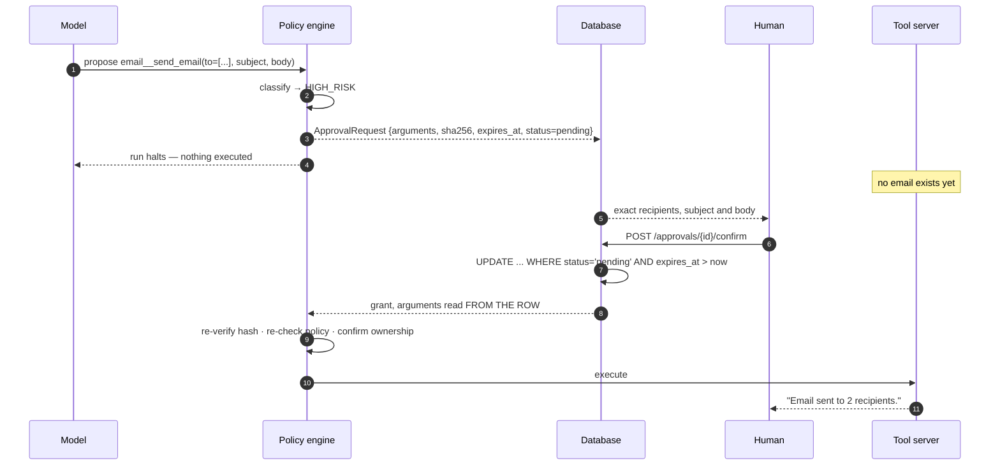

# Security model

Why an AI agent cannot be given unrestricted permissions, and exactly what stops this
one from acting on its own judgement.

- [The core problem](#the-core-problem)
- [Threat model](#threat-model)
- [Permission levels](#permission-levels)
- [Why the registry lives in the API process](#why-the-registry-lives-in-the-api-process)
- [Human-in-the-loop approval](#human-in-the-loop-approval)
- [Defence in depth](#defence-in-depth)
- [Audit logging](#audit-logging)
- [Credential management](#credential-management)
- [What this does not protect against](#what-this-does-not-protect-against)
- [Verifying the claims](#verifying-the-claims)

---

## The core problem

A language model is a text generator whose output is a function of its input — and in
an agent, some of that input comes from outside. A lead's "notes" field, an email
body, a web page: all of it flows into the context, and any of it can contain
instructions.

So the model must be treated as an **untrusted component that produces proposals**.
Not malicious, but not authoritative either. The practical consequences:

| Tempting approach | Why it fails |
|---|---|
| "Never send email without permission" in the system prompt | A prompt is a request. Injected text competes with it on equal terms. |
| Let the model decide what is risky | Judgement varies run to run, and the judgement itself is steerable. |
| Have the model emit `requires_approval: true` | The attacker controls that field too. |
| Trust the MCP server's `readOnlyHint` | It arrives over the wire from whoever runs the server. |
| Rely on a tool allow-list in the prompt | Nothing enforces it; a hallucinated name still reaches dispatch. |

The only durable guarantees are the ones the model cannot influence: **deterministic
checks in backend code, on a path the model's output cannot reach.**

That is the design principle here. The model chooses which tool to *propose*. Code
decides whether it runs.

## Threat model

**In scope:**

| Threat | Mitigation |
|---|---|
| Prompt injection steering the agent to a destructive tool | Policy engine classifies by tool name; injected text cannot change a dictionary lookup |
| Injection persuading the agent to email an attacker | HIGH_RISK gate; recipients originate from tool results, not prose; a human sees the exact list |
| Model hallucinating a tool name | Refused against the discovered catalog before any transport is touched |
| Arguments swapped between approval and execution | SHA-256 binding over canonical arguments, re-verified at execution |
| Replayed confirmation sending twice | Conditional `UPDATE`; exactly one confirmation wins |
| Stale approval firing later | TTL evaluated by the database |
| A user approving someone else's action | Ownership check on every decision |
| Privilege escalation via a role change | Policy re-evaluated at execution, even with a valid grant |
| Runaway loop mass-mailing | Hard recipient ceiling → outright `DENY`; iteration ceiling per request |
| Compromised tool server harvesting credentials | Per-server environment allow-lists |
| Leaking internals through errors | Deliberate errors only; everything else is a generic 500 |
| Credentials in logs or the audit trail | Redaction on every structured field before serialisation |

**Out of scope** (and honestly so): the security of the underlying database and its
network, the trustworthiness of a self-hosted model, physical and host security, and
the correctness of third-party MCP servers you choose to connect — for which the
fail-closed classification is a mitigation, not a solution.

## Permission levels

Every tool carries exactly one classification, from `app/security/permissions.py`.

### `READ` — runs automatically

`crm__get_leads`, `crm__get_lead`, `crm__search_leads`, `tasks__get_tasks`,
`tasks__get_overdue_tasks`, `spreadsheets__get_sales_summary`,
`spreadsheets__generate_weekly_report`, `calendar__get_events`,
`calendar__get_todays_meetings`, `email__draft_email`

Observes state; changes nothing. Requiring confirmation to *look something up* would
make the assistant useless and would train people to click confirm reflexively.

`email__draft_email` is READ on purpose: it composes text and sends nothing. Splitting
draft from send is what lets the agent show its work before asking.

### `WRITE` — runs automatically, reversibly

`crm__create_lead`, `crm__update_lead_status`, `tasks__create_task`,
`tasks__complete_task`, `spreadsheets__add_sales_record`

Changes internal business state. A human can undo it, the audit trail records who and
when, and nothing left the building. `REQUIRE_APPROVAL_FOR_WRITES=true` promotes these
to the HIGH_RISK bar where a deployment wants it.

### `HIGH_RISK` — always requires human approval

`email__send_email`, `calendar__create_event`

Irreversible, externally visible, or both. There is no configuration that turns this
off, and no role — including admin — that skips it. An admin may *decide* approvals;
that does not mean their agent stops asking.

`calendar__create_event` is here rather than in WRITE because booking a meeting writes
to other people's calendars and notifies them. The visible-to-others test matters more
than the "is it a write?" test.

### Unregistered — HIGH_RISK by default

```python
DEFAULT_PERMISSION = PermissionLevel.HIGH_RISK

def classify(qualified_name: str) -> PermissionLevel:
    return TOOL_PERMISSIONS.get(qualified_name, DEFAULT_PERMISSION)
```

Connect a new MCP server and its tools are immediately usable but gated. The cost of
forgetting an entry is an unnecessary approval prompt; the cost of the opposite
default is an unreviewed action. Discovery also logs every unclassified tool, so the
gap is noticed rather than merely tolerated.

## Why the registry lives in the API process

MCP tools can advertise `readOnlyHint` and `destructiveHint`. Using them for
authorisation would mean **asking the thing being authorised whether it should be
authorised** — and those hints arrive over the wire from whoever operates the server.

A hostile or merely misconfigured server can claim anything:

```jsonc
{ "name": "delete_all_customers", "annotations": { "readOnlyHint": true } }
```

So this project records the hint, compares it with local policy, and flags any
disagreement:

```python
@property
def hint_conflicts_with_policy(self) -> bool:
    """The server claims read-only but policy says otherwise."""
    return bool(self.server_read_only_hint) and self.permission != PermissionLevel.READ
```

A conflict is logged at discovery and surfaced on `GET /api/v1/tools` as
`server_read_only_hint` alongside the authoritative `permission`. The local
classification always wins.

There is a test named
`test_server_read_only_hint_does_not_override_policy` asserting exactly this.

## Human-in-the-loop approval

### What happens



### The guarantees, and the attack each one answers

**1. An approval is bound to exact arguments.**

```python
arguments_hash = hash_payload(arguments)   # SHA-256 over canonical JSON
```

Canonical means sorted keys and fixed separators, so logically identical payloads hash
identically across processes and time, while any semantic change — a different
recipient, an extra address, an altered subject — produces a different digest.

*Stops:* draft something benign, obtain approval, substitute recipients before
sending.

**2. The approver sees what will actually run.** The summary is generated by backend
code from the arguments themselves:

```python
return f"Send an email with the subject '{subject}' to {len(recipients)} recipient(s): {shown}{more}."
```

*Stops:* the model describing "an email to Ada" while the arguments address a hundred
people. If the model wrote the description, the human would be approving the
description rather than the action.

**3. Confirmation is atomic and single-use.**

```python
UPDATE approval_requests
   SET status = 'approved', decided_at = ..., decided_by_id = ...
 WHERE id = :id AND status = 'pending' AND expires_at > :now
```

Exactly one caller gets `rowcount == 1`. A read-then-write in Python would leave a
window in which two concurrent confirmations both proceed.

*Stops:* a double-clicked button, or a retry, sending the same email twice.

**4. Execution uses the stored arguments, never the request.** The confirm endpoint
accepts only an id and an optional note. There is no parameter through which a
confirming caller could influence what runs.

**5. A grant carries no authority of its own.** `ApprovalGrant` is an ordinary
dataclass anyone could construct, which is precisely why the executor re-reads the row
and re-verifies status, expiry, tool identity and hash. Authority lives in persisted
state, not in an in-memory object.

*Stops:* a bug — or a compromised code path — minting a grant and skipping the gate.

**6. Policy is re-evaluated at execution.** A valid approval does not survive the
caller losing permission in the meantime.

**7. Only entitled users decide.** Viewers cannot approve at all; non-admins can only
decide requests raised in their own conversations.

*Stops:* one user rubber-stamping another user's pending email.

**8. Approvals expire.** TTL is evaluated inside the `UPDATE` predicate, closing the
check-then-act gap.

*Stops:* an approval sitting for a week and firing into a world that has changed.

### What the LLM cannot do

- It cannot create, approve, expire or delete an approval — no tool maps to those, and
  no path from model output reaches a FastAPI route.
- It cannot change a tool's classification.
- It cannot execute a HIGH_RISK tool. `MCPManager.call_tool` is reachable only through
  `ToolExecutionService`, and that path always evaluates policy first.
- It cannot smuggle an action past review by describing it inaccurately: the human
  reads a summary and arguments generated from the payload.

## Defence in depth

Layers that hold even if one above fails:

| Layer | Guard |
|---|---|
| Prompt | Behavioural guidance only — explicitly *not* load-bearing |
| Discovery | Unregistered tools classified HIGH_RISK; conflicting hints flagged |
| Catalog | Hallucinated tool names refused before any transport |
| Schema | Arguments pre-validated against the discovered JSON Schema |
| Policy | Deterministic verdict; DENY is never downgraded |
| Approval | Argument-bound, single-use, TTL, ownership-checked |
| Integration | Recipient limits and address validation at the boundary |
| Repository | Every list query clamped; grouping columns from an allow-list, never interpolated |
| Runtime | Container runs as non-root; per-server credential scoping |
| Errors | Deliberate errors only; everything else is a generic 500 |

Two examples of a lower layer holding independently:

```python
# app/repositories/sales_repository.py — reachable from model-proposed arguments
column = columns.get(group_by)
if column is None:
    raise ValueError(f"Unsupported grouping {group_by!r}. Expected one of: ...")
```

```python
# app/security/policy.py — a limit that is not a decision to delegate
if recipients > MAX_EMAIL_RECIPIENTS_HARD_LIMIT:
    return decide(PolicyOutcome.DENY, ...)
```

The second is deliberately `DENY`, not `REQUIRE_APPROVAL`: emailing 200 people in one
action is far more likely to be a runaway loop than an intention, and offering a
confirm button invites someone to click it.

## Audit logging

Every decision and action is recorded in `audit_logs`:

- agent events — request received, tools discovered, decision, response, error;
- policy verdicts, including blocks and the reason;
- tool calls — started, succeeded, failed, blocked — with arguments, results and timing;
- approval events — requested, confirmed, rejected, expired, executed;
- MCP connection events.

Design choices that make it useful:

- **Append-only.** No update or delete method exists on the repository.
- **Committed immediately**, outside the caller's transaction. If a request later fails
  and rolls back, the record of what was attempted survives — an audit trail that
  vanishes with the incident it documents is not an audit trail.
- **`ON DELETE SET NULL`** on user and conversation references, so removing a user
  cannot erase the history of what was done in their name.
- **Correlated by `request_id`**, matching the `X-Request-ID` header the client saw.

Reconstructing an incident:

```sql
SELECT created_at, event_type, outcome, tool_name, permission_level, summary, duration_ms
FROM audit_logs
WHERE request_id = '6f1c2a8e9b3d4f5a'
ORDER BY created_at;
```

```sql
-- Everything a human approved, and what it did
SELECT a.decided_at, u.email AS approver, a.tool_name, a.summary, a.status
FROM approval_requests a
JOIN users u ON u.id = a.decided_by_id
WHERE a.status IN ('executed', 'failed')
ORDER BY a.decided_at DESC;
```

## Credential management

**Never stored in plaintext.** API keys are held as SHA-256 digests; lookup is by
digest, so a plaintext key never appears in a query or a query log. Verification is
constant-time.

SHA-256 rather than bcrypt/argon2 is deliberate and narrow: API keys here are
high-entropy machine-generated secrets, so offline brute force is not realistic.
*User passwords would need a slow KDF* — this project stores none.

**Never logged.** `redact()` runs over every structured log field and audit payload,
matching both key names (`password`, `api_key`, `authorization`, `token`, `secret`,
`smtp_password`, …) and credential-shaped values in free text (`sk-…`, `Bearer …`,
`ghp_…`, `pat-…`), because a model can echo a key back inside an error message.

**Never in `repr`.** Secrets are `SecretStr`, so an accidental log of the settings
object prints `SecretStr('**********')`.

**Never on a command line.** MCP subprocesses receive configuration through the
environment, not argv, where it would be visible to anyone who can list processes.

**Scoped to the server that needs them.** Each MCP server gets its own allow-list:

```python
SERVER_ENV_VARS = {
    "crm":   ("CRM_PROVIDER", "HUBSPOT_ACCESS_TOKEN"),
    "email": ("EMAIL_PROVIDER", "SMTP_HOST", "SMTP_USERNAME", "SMTP_PASSWORD", ...),
    "tasks": (),
}
```

The email server never sees the HubSpot token; the CRM server never sees the SMTP
password. If one tool server is compromised, the blast radius stops at what it was
given. There is a test asserting this.

**Never committed.** `.env` is gitignored; only `.env.example` is tracked, with
placeholders.

## What this does not protect against

Stated plainly, because a security document that claims completeness is not credible:

- **A compromised database.** Anyone who can write `approval_requests` directly can
  forge an approval. The integrity hash detects argument tampering, not an attacker who
  recomputes it.
- **A malicious operator.** Someone who can change `permissions.py` and deploy can
  reclassify anything.
- **A compromised MCP server.** Classification limits *which* of its tools run without
  asking; it does not make a hostile server's tools safe. Only connect servers you
  trust, and keep the fail-closed default.
- **Prompt injection making the agent unhelpful.** The guarantees are about actions,
  not output quality. Injected text can still produce a misleading *answer* — which is
  why figures in reports are computed in SQL rather than generated.
- **Data exfiltration through a READ tool.** A user entitled to see leads can be
  socially engineered into asking for them. Role scoping limits this; it does not
  eliminate it.
- **Denial of service.** There is an iteration ceiling per request but no global rate
  limit or spend budget. Put a gateway in front of it.

## Verifying the claims

Every guarantee above has a test. To check rather than trust:

```bash
pytest tests/unit/test_permissions_and_policy.py -v   # classification + every policy branch
pytest tests/unit/test_approval_service.py -v         # binding, replay, expiry, forged grants
pytest tests/unit/test_core_security.py -v            # redaction, hashing, key handling
pytest tests/integration/test_tool_execution.py -v    # the gate, against real MCP servers
pytest -m slow -v                                     # per-server credential isolation
```

Tests worth reading first, because they encode the properties that matter most:

| Test | Property |
|---|---|
| `test_unregistered_tool_is_high_risk` | Fail-closed default |
| `test_server_read_only_hint_does_not_override_policy` | Server hints are not authority |
| `test_classification_ignores_the_spec_object` | Classification comes from the registry, not a passed-in object |
| `test_tampered_arguments_are_refused` | Approved payload == executed payload |
| `test_confirmation_is_single_use` | No double execution |
| `test_a_forged_grant_is_rejected` | Grants carry no authority |
| `test_execution_is_refused_when_policy_would_now_deny` | Approval does not outlive permission |
| `test_send_email_does_not_execute_without_approval` | Nothing leaves without a human |
| `test_later_steps_do_not_run_after_a_pause` | A pause stops the batch |
| `test_secrets_are_scoped_to_the_server_that_needs_them` | Least-privilege credentials |
| `test_internal_errors_do_not_leak_details` | No internals in responses |
